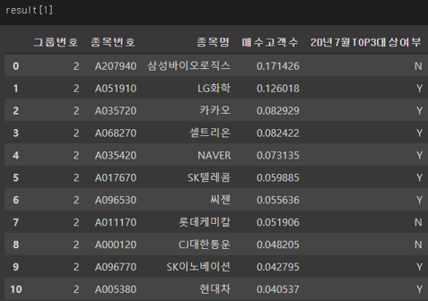
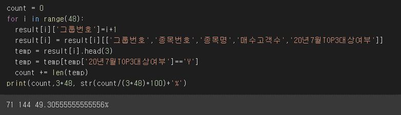

# mirae_project
## 1. Introduction
  - 과거의 주식거래 내역을 활용하여, 미래의 매수 고객 수를 예측하는 알고리즘입니다. 
  - 48개 그룹의 미래의 상위 거래 종목을 예측하였습니다.
  - 시계열 데이터에 적합한 LSTM 알고리즘을 기반으로 개발하였습니다.
  - 일별 데이터를 입력 데이터로 활용하고, 해당 월의 매수 고객수를 학습하는 알고리즘을 구현하였습니다.
## 2. 파일 설명
  - trade_train.csv : 48개 그룹 별로 매수 고객 수, 거래량 등의 월별 데이터입니다. (출처 : 공모전 주최 제공)
  - stocks.csv : 각 주식 종목의 일별 종가, 시가 등이 포함된 데이터입니다. (출처 : 공모전 주최 제공)
  - fi_big.csv : 각 주식 종목의 TEMA, CMF 등의 지수가 포함된 데이터입니다. (출처 : 네이버 금융 데이터)
## 3. 실행 환경
  - 활용 언어 : python
  - 개발 환경 : Jupyter Notebook & Colab
## 4. 실행 화면
```python
from sklearn.model_selection import train_test_split
from keras.models import Sequential
from keras.layers import Dense
from keras.callbacks import EarlyStopping, ModelCheckpoint
from keras.layers import LSTM

m_data.sort_values(by=['그룹번호','기준년월','종목번호'],inplace = True)
d_data.sort_values(by=['그룹번호','기준년월','종목번호','기준일자'],inplace = True)

train_feature, train_label = make_dataset(d_data[['TEMA', 'CMF', 'MACD Oscillator', 'Stochastic Oscillator',
       '개인 순매수','KOSPI','S&P500']],
                                                  m_data['매수고객수'],19)

x_train, x_valid, y_train, y_valid = train_test_split(train_feature, train_label,
                                                      test_size=0.2)

model = Sequential()
model.add(LSTM(16, 
                input_shape=(train_feature.shape[1], train_feature.shape[2]), 
                activation='relu', 
                return_sequences=False))
model.add(Dense(1,))
model.summary()
model.compile(loss='mean_squared_error', optimizer='adam')
early_stop = EarlyStopping(monitor='val_loss', patience=15)
filename = filepath+'result.h5'
checkpoint = ModelCheckpoint(filename, monitor='val_loss', verbose=1, 
                              save_best_only=True, mode='auto')
history = model.fit(x_train, y_train, 
                    epochs=200, 
                    batch_size=16,
                    validation_data=(x_valid, y_valid), 
                    callbacks=[early_stop, checkpoint])    
print('Finish')
```
- 입력 데이터 : 종가, TENA, CMF, NACD Oscillator, Stochastic Oscillator, 개인 순매수, g_vec
- 출력 데이터 : 매수 고객 수
- LSTM 모델 활용
- Optimizer은 Adam 활용
- Checkpoint 함수를 사용하여 가장 좋은 성능의 파라미터를 파일에 저장
- EarlyStopping을 활용하여, 더 이상 성능이 개선되지 않을 시 15번까지 반복 후 종료


- 2번 그룹의 매수 고객 상위 종목 list
- 매수 고객 수는 minmaxscaler를 활용하여, 0과 1사이의 값으로 변환
- 현재 20년 7월 Top3 대상여부에 2개 종목 적중


- 상위 3개 종목 48개 그룹의 종목 수(144개) 중 71개 적중
- 약 49%의 정확도 확인
